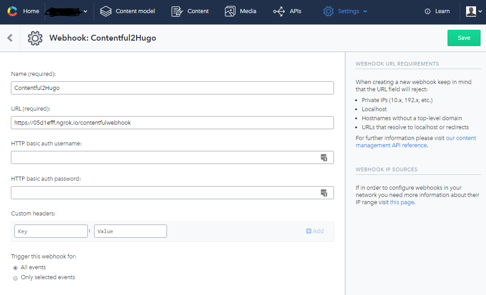

# Contentful to Hugo #

This is a example of how to use ContentAggregator to create a static but automatically updated website by using Contentful together with Hugo.

Read more about Contentful CMS: http://contentful.com/

Read more about Hugo static website generator: http://gohugo.io/

Read more about ContentAggregator: https://bitbucket.org/aretera/contentaggregator

## Quick start ##

Prerequisite: Install Docker https://www.docker.com/

From Powershell:
```
$env:spaceId="<contentful_space_id>"
$env:accessToken="<contentful_acessToken>"
docker-compose up
```

Bash:
```
export spaceId=<contentful_space_id>
export accessToken=<contentful_acessToken>
docker-compose up
```

Wait a moment and then browse to http://localhost/

Or in more detail how to start the ContentAggregator container manually:

```
docker run --rm -it -v ${Pwd}:/project -v ${Pwd}/hugo_src/content:/var/output ${Pwd}/hugo_src/static/images/:/var/images -p 80 -e "spaceId=<contentful_space_id>" -e "accessToken=<contentful_acessToken>" --name contentful2hugo aretera/contentaggregator:next-sdk --verbose=off
```

* ```--rm``` - Remove container when finished
* ```-it``` - Interactive
* ```-v``` - Mount volume
* ```-e``` - Set environment variable
* ```-p``` - Expose port to host
* ```--name``` - Set container name

## Modifying Markdown output ##
ContentAggregator generates markdown from the content found in Contentful CMS.
You can easily change how the markdown is generated for different content types by modifying the Typescript file ```./modules_src/hugo.ts```.

No need to rebuild or compile, just restart the Contentaggregator Docker container. (ctrl-c then `docker-compose up`)

## How does it work? ##

ContentAggregator uses the configuration in ```contentaggregator.yml``` to fetch and process the content from Contentful. 
It then invokes the Node module hugo to convert it markdown and then stores it to disk. Images (assets) are downloaded.

Hugo watches for changes and generates html files from the markdown.

## Contentful webhooks ##
To avoid delays when editing in Contentful you can use Webhooks for immediate publish of changes.
In Contentful, configure a webhook endpoint to `/contentfulwebhook` in the ContentAggregator container port 80. (see below)

## Contentful webhooks using ngrok ##
A helpful tool to allow incoming trafic through firewalls etc is https://ngrok.com/ which can be run inside a Docker container.

```
docker run -d -p 4040:4040 --link contentful2hugo --name contentful2hugo_ngrok wernight/ngrok ngrok http contentful2hugo:80
```
Find the ngrok public url by either browsing to http://localhost:4040/status or 
```
curl localhost:4040/api/tunnels
```

In Contentful admin, under Settings -> Webhooks add a new Webhook with the ngrok public url with the path /contentfulwebhook



For more information about running ngrok in Docker check out https://github.com/wernight/docker-ngrok

## Docker compose ##

A Docker Compose configuration file is ready for use in this repository. It configured to run Hugo, ContentAggregator, ngrok and a nginx webserver.

Just start it with 

Powershell:
```
$env:spaceId="<contentful_space_id>"
$env:accessToken="<contentful_acessToken>"
docker-compose up
```

Bash:
```
export spaceId=<contentful_space_id>
export accessToken=<contentful_acessToken>
docker-compose up
```
## Important note about security ##

The webhook endpoint is not access restricted and open for anyone. If you exposed it to the internet, either directly or via ngrok, you must
consider the security issues that araises. It is recommended that you use some kind of proxy in front of the exposed endpoint to 
limit access.

## Questions? ##

Feel free to send me a message!
